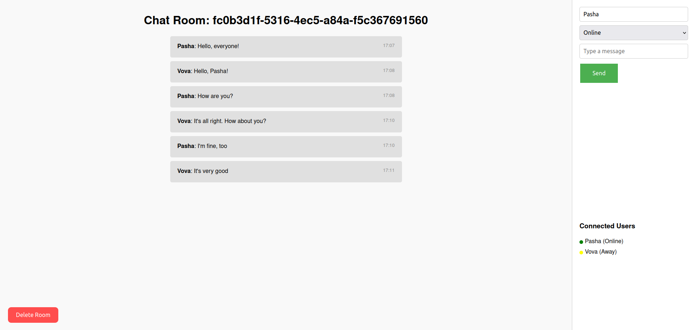

# Web Chat

### Showcase

    

### About project

This application is a regular web chat in separate rooms with saving chat history

### How does the project work?

This chat works on web sockets

### Requirements for launching the project

To start the project, you will need:

1. Docker >= 26.0.0
2. Docker Compose >= 1.29.2

### How to launch the project?

1. Clone a repository:

   `git clone https://github.com/shavlenkov/web-chat.git`

2. Go to the web-chat folder:

   `cd web-chat`

3. Run containers using Docker Compose:

   `docker compose up -d`

4. Open a browser and go to the address:
   [http://localhost:8080](http://localhost:8080 'http://localhost:8080')
